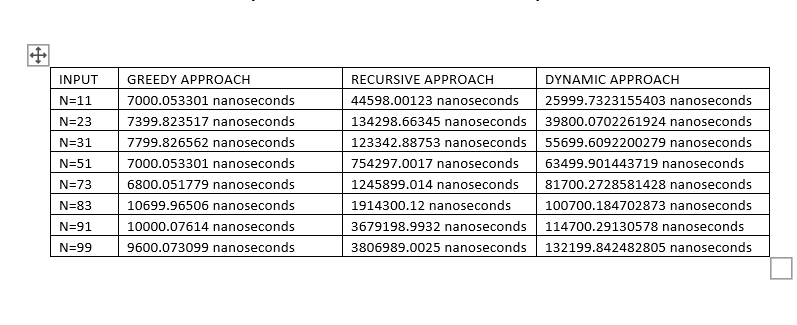
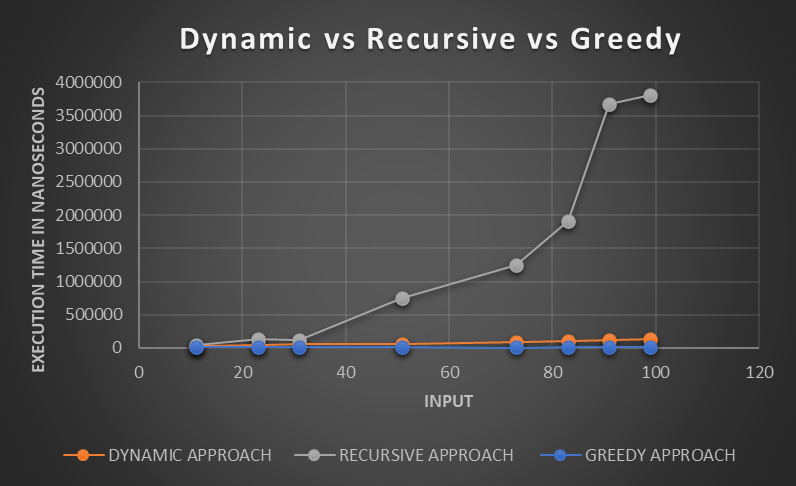
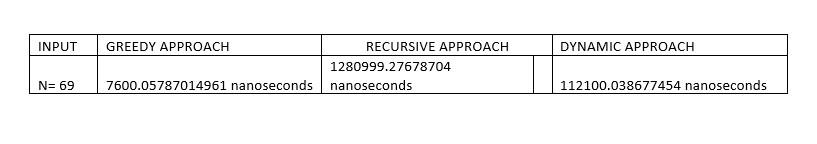
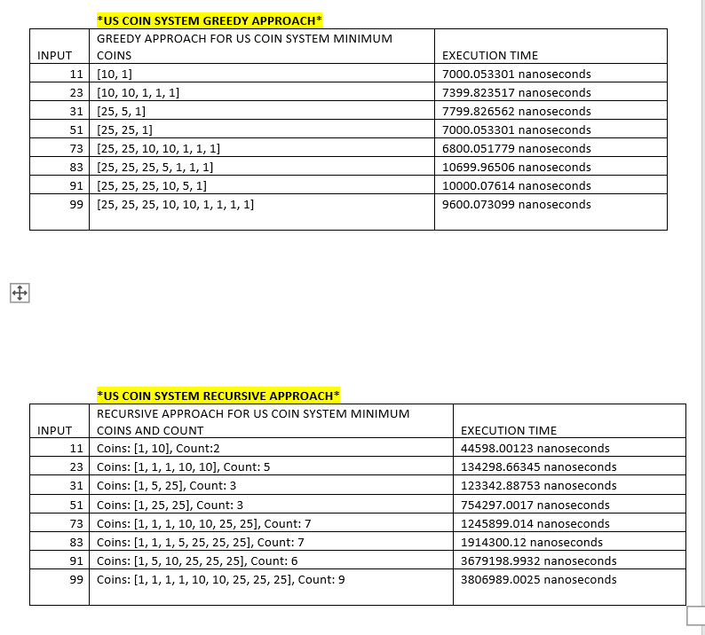
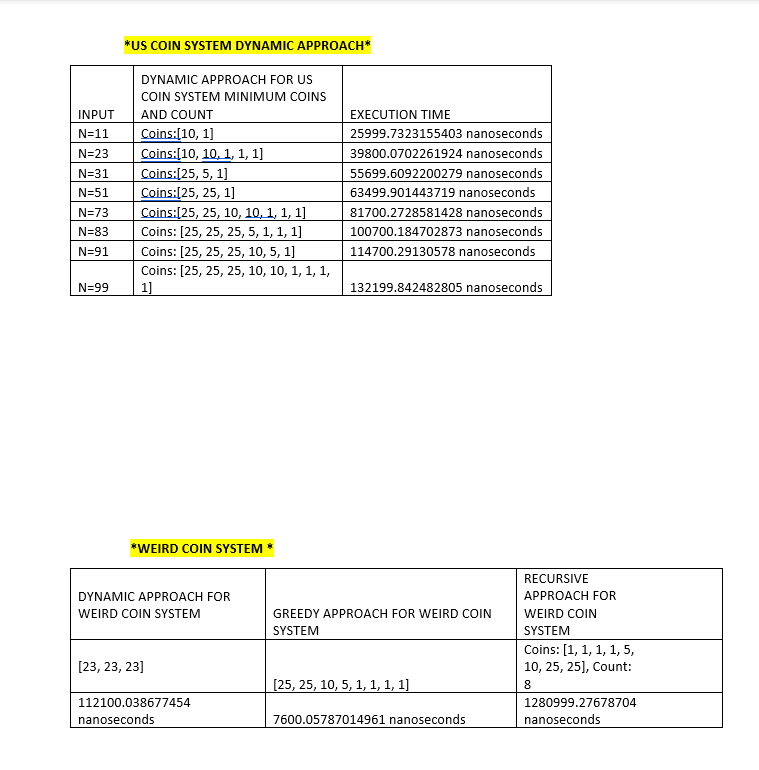

# CoinProblem

## Description
In this project, I have completed change making problem using three solutions

1. A straight-forward recursive solution 
2. A solution using Greedy Algorithm
3. A solution using Dynamic approach.

## Test Data
i. I have tested each of my solutions on the following input: n= 11, 23, 31, 51, 73, 83, 91, 99 while
assuming US coin system, i.e., k = 4 and d[1] = 1 (i.e. penny), d[2] = 5 (i.e. nickel), d[3] = 10 (i.e.
dime), and d[4] = 25 (i.e. quarter).
ii. I have tested each of my solutions on a weird coin system which has 5 coins (penny, nickel, dime, 23
cents, and quarter), i.e., k = 5, and d[1] = 1, d[2] = 5, d[3] = 10, d[4] = 23, d[5] = 25, for n = 69.

## Requirements for this project.

I have done the Recursive approach and Greedy approach program in python language.
1.Install Python --- https://www.python.org/downloads/

### Steps to run my project are:
I have submitted the project on canvas so you have to download it from there.
1. Download the file and save it wherever you want and then unzip it.
2. After unzipping you will find a batch file there which will run all the programs and
   will give the output for all the test data.
3. The name of the batch file is run.bat, you just have to use cmd /c run.bat command in visual studio terminal or command line and you will 
   get all the output or you can just click on the batch file and all the outputs will get displayed.

Name of python file are:
Greedy.py
Recursive.py
Dynamic.py

Name of Batch file is:
run.bat

## Theoretical Analysis
•	What is a Coin Change Problem?
The main objective of this problem is to find the minimum number of coins as change for a given value(n) from a set of denominations (k-size integer array d (i.e., d[1, 2, …, k])).
There are 2 approaches for Coin Change Problem:
1. Recursive
2. Greedy
3. Dynamic 

Using these two approaches we have to test 2 types of data.
I. US Coin System
Test for different value of n = 11, 23, 31, 51, 73, 83, 91, 99
Denomination -> k = 4 and d[1] = 1 (penny), d[2] = 5 (nickel), d[3] = 10 (dime), and d[4] = 25 (quarter).
II. Weird Coin System
Test for n = 69
Denomination -> k = 5, and d [1] = 1, d[2] = 5, d[3] = 10, d[4] = 23,
d [5] = 25

## Approach
1. Recursive
We can solve coin change problems using recursion. So, basically, we have two options for each coin- either to include it in solution or to exclude it from solution. But it is extremely inefficient because there is one problem that this approach solves the sub-problems again and again. A lot of time is wasted in calculating the old result.
Time complexity: O(2^(m+n)) (Exponential time complexity due to overlapping subproblems.)

2. Greedy
This approach comes up with solutions piece by piece. It makes greedy choice at each step to ensure optimality. The main idea of Greedy approach is to make locally optimal choices in order to get globally optimal solutions. Greedy approach may not give the optimal solution.
Time complexity: O(mlogn)
3. Dynamic 
This approach divides the problem into smaller pieces. Dynamic programming solves the recursive approach in more efficient manner as it stores the result of sub-problems for future use instead of re-computing Dynamic Programming always makes right decision as it always solves the sub-problem before making choice. Dynamic approach gives efficient solution with optimal substructure and avoids redundant calculations.
Time complexity: O(m*n) 

## COMPARISION
- Tables and Graphs
US COIN SYSTEM (GREEDY VS RECURSIVE APPROACH)

- GRAPHS

 
- WEIRD COIN SYSTEM (GREEDY VS RECURSIVE APPROACH)

## ANALYSIS AND DISCUSSION
In this project, I have tried three approaches (recursive, greedy and dynamic) for the US coin system and weird coin system. For recursive approach I analyzed that it does take more time in comparison to the greedy approach because in recursive approach, subproblems are computed again and again instead of storing them. On the other hand, Greedy Approach works fine for US Coin System but for the weird coin System it does not generate an optimal solution. Hence, Greedy is not always optimal.

The difference between greedy and recursive approaches is that the recursive approach finds the optimal solution but is very slow and requires some memory for recursive calls whereas the greedy approach does not always find the optimal solution, but it is fast and requires almost no memory. After performing these two algorithms when I used dynamic programming to solve this problem, I analyzed that dynamic programming always gives the optimal solution by taking O(m*n) time which is less in comparison to recursive because recursive takes exponential time to perform the coin change problem. 

The difference between recursion and dynamic programming is that dynamic programming is a little bit intelligent version of recursion. Recursion does not store solution and output of one part is dependent on the output of the second part of subproblems whereas dynamic approach splits the problem into subproblems, stores their solutions and uses them if needed in the future. The difference between dynamic programming and greedy programming is that a dynamic approach makes the decision at every stage and is a more efficient and greedy approach makes the decision based on the first stage and is less efficient. The greedy approach first makes the best choice and then solves the subproblem whereas the dynamic approach solves all the subproblems and then selects which will find the optimal solution.

Greedy is much faster in comparison to the other two approaches but it does not always provide the optimal solution. The results from the Greedy, Recursive, and Dynamic Programming approaches for the Coin Change problem can differ in terms of the number of coins used to reach the target amount. Greedy and Recursive approaches may not always give the optimal solution, while Dynamic Programming ensures the optimal solution efficiently by avoiding redundant calculations.

## OUTPUT GENERATED 
	

		

